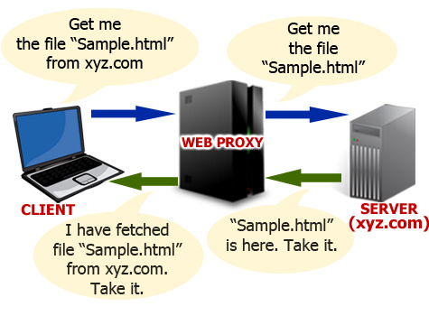

# What is a Proxy Server?
A proxy server (or proxy) is a computer that acts as both a client and a server, as an intermediary between sender and receiver. The sender sends a request to the proxy, and the proxy makes a request to the receiver on the sender's behalf. The proxy then forwards the message received from the receiver, back to the original sender. By intercepting connections between sender and receiver, it is possible to log incoming and outgoing connections, modify requests and responses, block requests to certain hosts, among other uses.

# How does it work?

Whenever a client makes a request for a specific resource from a remote server, rather than requesting it directly from the remote server, the request is sent to the proxy. As an example, in Figure 1, the client sends the request for `Sample.html` residing at `xyz.com`, not to `xyz.com` but to the proxy server. The proxy server then requests the file `Sample.html` from the server `xyz.com` on the client's behalf. The server `xyz.com` sends the response to the proxy which then forwards it back to the client.

# Types and Uses
Although several types of proxies exist, each with different uses, proxies can be essentially divided into 2 types: forward proxies; and reverse proxies [@3_arntz_2013].

## Forward Proxy
A forward proxy aims to simply forward client requests to the target server. The server sees not the actual client but the proxy and sends the response to the proxy, which then forwards the response back to the client. The example described above is a forward proxy. Forward proxies tend to benefit the client, by providing anonymity amongst other benefits.

## Reverse Proxy
Unlike forwarding proxies, where the client typically knows that it is connecting through a proxy, a reverse proxy appears to the client as if it is an ordinary server. The reverse proxy also forwards the client request to the actual server, however this is not known to the client. The client is given the impression that it is being served by the actual server but in reality there exists a reverse proxy between the client and the server.
Reverse proxies tend to benefit the server, rather than the client, for example by reducing load on the actual server and enhancing security.

## Other types of proxies
Although proxies can be divided into one of the two proxy types mentioned above, proxies are also divided into categories (Level 1-3) that indicate the level of anonymity provided [@2_proxynova_2016], with level 3 providing the least amount of anonymity and level 1 providing the most.

### Transparent Proxies (Level 3)
Transparent proxies are a type of forwarding proxy that includes detailed information about the client. As a result they provide almost no level of anonymity. These proxies are also known as *caching proxies* since their intended purpose is not to provide anonymity but to cache the data exchanged between client and server, in order to speed up the response time.

These types of proxy servers typically also eliminate client side configuration and instead resides on the gateway that intercepts WWW requests from the client, fetches the content, and caches it locally for future requests [@4_andrew_2010]. Future requests can be replied to straight from the local cache increasing the speed of delivery.

The name "transparent" comes from the fact that the client does not know that there is a proxy interacting and mediating the request.

### Open Proxy
Open proxy is another type of forward proxy which, as the name suggests, are openly available for anyone to use over the internet. This type of proxy is most often used by people to conceal their actual IP address in order to remain anonymous while browsing the web. Within the open proxy category there also exists several types of proxies.

#### Anonymous Proxy (Level 2)
As the name suggests, this type of open proxy exists to conceal the IP address of the client so that the target server will not be able to identify the origin of the client request. The anonymous proxy will identify itself as a proxy server while still keeping the user anonymous. One type of anonymous proxy is *distorting proxy* which, rather than simply concealing the client's IP address, can instead reveal an incorrect IP address to the target server.

#### High Anonymity (or Elite) Proxy (Level 1)
This type of open proxy provides the maximum level of anonymity. It does this by neither identifying itself as a proxy to the client, nor revealing the original IP of the client. This kind of proxy is rarely free to use and in most cases require some sort of payment for access [@1_ramesh_2015].

# Improving Client-server Performance
A large corporation would significantly benefit from implementing a transparent/caching proxy. By having a local caching proxy server, requests that have been accessed previously can be cached and served directly from the local server, meaning the external server does not need be contacted at all.

If a client does not care for anonymity, performance could be increased by not tunnelling through an open proxy. Since an open proxy acts as an intermediary, an extra step is required between the client and the server making the response time longer. A client could also increase performance by implementing a local forwarding proxy that blocks certain bandwidth-consuming requests. For example, blocking access to ad-network hosts means less bandwidth spent on loading ads, blocking requests to `.swf` would increase speed since `.swf` files can be really big, etc. If bandwidth is scarce or if the client is only looking at webpages largely only consisting of text, blocking all images would also drastically improve page-loading times.

A web server could also benefit from implementing a reverse proxy, such that traffic can be reduced to the main server. If multiple servers exist in multiple locations, the reverse proxy can also help to detect the closest server location and request the resource from there to save time.

# References
