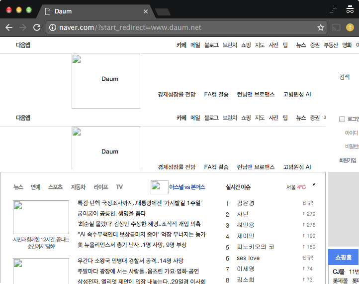
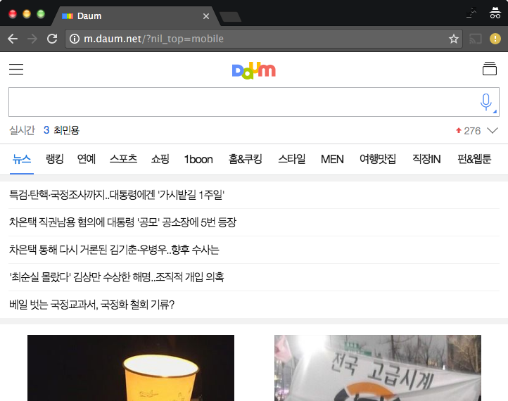
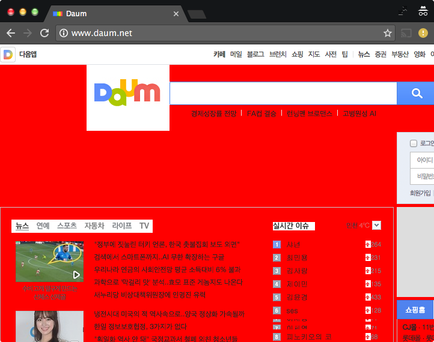
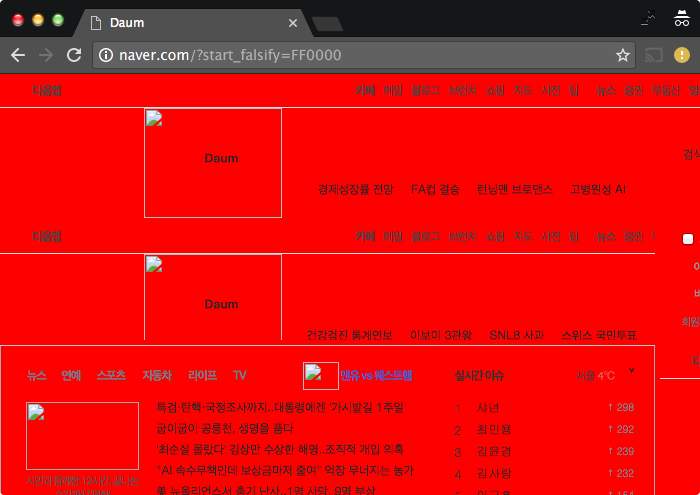

#Introduction

This program is a simple proxy server that logs all HTTP traffic (not HTTPS) and provides some basic options such as domain-level redirection, User-Agent substitution, and changing of website background colour. You can compile it using the `make` command or alternatively:

```
gcc -o project_3 project_3.c -std=c99
```

To run the program, execute:

```
./project_3 9001
```

This will serve the proxy server on the address: *<http://127.0.0.1:9001>*.

#Implementation Scope
As mentioned in the introduction, HTTPS is not supported and the only HTTP method supported is GET. Any other method requested returns a 403 Forbidden response. Due to its complexity, HTTP persistent connections are not supported and instead relies on the HTTP/1.0 protocol to communicate with servers. This allows for an easier implementation since the HTTP/1.0 protocol requires the server (although not all servers actually do this) to send, with the response, a Content-Length field.

The proxy server supports 3 configurable options: domain-level redirection, User-Agent substitution, and "falsification" -- the customisation of the requested website's background colour.

##Domain-level Redirection
This allows you to re-route all traffic to a specific host. It can be configured by requesting any website with the query: `?start_redirect=example.com`. For example, sending a request to *<http://naver.com?start_redirect=yonsei.ac.kr>* will redirect all requests (that aren't already hosted there) to *<http://yonsei.ac.kr>*. This can be disabled by sending the following query `?stop_redirect`.

Since this performs a domain level redirection, any requested components of a website that are not located at the specified domain will refuse to load. This means that redirecting to a website that heavily relies on a content delivery network (CDN) located at an external address will likely to appear to be broken (see figure 1).

##User-Agent Substitution
This allows you to set the default User-Agent of the request to a mobile device, rather than the default User-Agent (of the browser). Currently, the mobile user-agent of choice is: `Mozilla/5.0 (Linux; Android 5.1.1; Nexus 5 Build/LMY48B; wv) AppleWebKit/537.36 (KHTML, like Gecko) Version/4.0 Chrome/43.0.2357.65 Mobile Safari/537.36`, taken from an LG Nexus 5, running Android 5.1.1. Enable this mode with a query of `?start_mobile` and disable it with `?stop_mobile`. For example: *<http://daum.net?start_mobile>* will show the mobile version of the website (see figure 2).

##Falsification
This allows you to customise the background colour of all webpages you visit -- demonstrating the modification of contents before reaching the client. You can set the background colour to any colour representable by hexadecimal. It can be configured by requesting any website with the query: `?start_falsify=COLOUR`, where `COLOUR` is a hexadecimal representation of a colour. For example: *<http://daum.net?start_falsify=FF0000>* will show the website with a red background colour when the usual background colour (at least at the time of writing) is white (see figure 3).

This is done by directly adding the CSS attribute `background-colour` to the style attribute of the `<body>` tag. This has a higher style priority that if we were to simply append a `<style>` tag to the HTML document.

You can disable this mode with the query `?stop_falsify`.

Note: All three of these options can be used simultaneously (see figure 4).

#Code Commentary

The program first ensures that a sufficient number of arguments is passed in. If not, the program drops out printing the usage information. Otherwise, the program passes the port that was specified in the command line to `setup_server()`.

`setup_server()` first defines a set of hints which will call `getaddrinfo()` to return a linked list of address information which we store in `servinfo`. We loop through the list until we can successfully instantiate a socket. We call `setsockopt()` in order to enable the reuse of ports and disable the exiting of the program if we attempt to write to a closed socket (which could happen if a client disconnect prematurely). Once we have successfully bound the socket, we break the loop and free the memory of `servinfo` since it is no longer needed. We then begin to listen on the socket for incoming connections.

If a connection is detected the server will call `getnameinfo()` to store the client's address and port into `hoststr` and `portstr`. The server then attempts to receive the request message from the client. If successful, it will call `parse_request()` which first uses `sscanf()` to extract the request method, URL, and HTTP version from the header. Using `strsep()` it then reads through the request line by line, using `\r\n` as the delimiter. `strncmp()` is used to check the request lines for the Host and the User-Agent. The pointer `string` is incremented at the end of each loop in order to skip past the `\n` character. All the information extracted from the header is stored in a custom structure `struct request`.

Once `parse_request()` resolves, the main function looks at the HTTP method to exclusively only serve GET requests. Any other request method will return a 403 Forbidden status code and the socket to the client is closed. If a GET request was received however, `check_modes()` will read the requested URL path and update the global `struct modes` variable `m` to include any configurable options that may have been applied. It does this by finding the first occurrence of the `?` character in the request path and determining if the query keys match any of the predefined options. Once complete, the `?` character is replaced with a `/0` to terminate the string at that point removing any of the configurable options from ever reaching the requested server.

Next, back in the main function `handle_request()` is called, which first prints out the current modes (domain redirection, mobile User-Agent, and falsification options) as well as other information such as the client address and port number and requested URL. `connect_host()` is then called, which depending on whether or not redirection is enabled, will attempt to initiate a socket at either the requested host, or the manually configured target redirect host, connecting to port 80. If successful, the socket is returned back to `handle_request()`, and a message indicating the name of the connected host is printed.

`send_request()` is then called, which generates a HTTP request message based on the global `struct request` variable `req`. If the redirection is enabled, and the requested host is different to the specified redirection host, it will generate a request to the root of the specified redirection host instead. It then writes this to the socket that was returned by `connect_host()`.

If the request was written and a response was received from the server, `handle_request()` will then determine what kind of response it was using `parse_response()`. This, like `parse_request()`, first uses `scanf()` to retrieve the HTTP version, the status number, and the response status. Also like `parse_request()` it loops through the response line by line to extract information such as Content-Length and Content-Type. This information is stored in the global `struct response` variable `res`.

Using the information in `res`, if we know the exact length of the response body we're expecting, we simply loop through, continuously calling `recv()` and sending the response to the client until we've received the indicated number of bytes. Otherwise, if we don't know how many bytes we're receiving, we most likely received a response with chunked transfer encoding. To handle this, we continue to loop through calling `recv()` until we receive a response that we detect the last four bytes to be `0\r\n\r\n`, indicating the end of a chunked transfer encoding response.

To send the response information to the client's web browser we use the function `falsify()`. If falsification is required, it will attempt to look through the body of the request to find the start of the `<body>` tag (as long as the content type of the response is HTML). If it finds it, it will write up to that tag (not including the tag closing bracket) to the client's web browser socket. It then writes the style attribute and the desired background colour before writing the rest of the response. `falsify()` also modifies the parameter `*status` in order to indicate whether the falsification was successful or not. Once this completes, `handle_request()` will print out information such as the content type of that response as well as the number of bytes the proxy received from the server, as well as the number of bytes the client received from the proxy. The client and the server sockets are then closed, before returning control back to `main()`.

#How It Works
The breakdown of the code can be summarised as follows:

1. `setup_server()` is called to setup a client socket
2. a connection request is received and `parse_request()` is called to determine request information
3. non-GET requests are filtered out
4. configured options are determined using `check_mode()`
5. `handle_request()` is called and a socket connection to the requested host server (or target redirect host server) is created using `connect_host()`
6. the request is sent to the host server using `send_request()` making any adjustments if necessary (e.g. changing host and/or path for redirection, or User-Agent string for mobile configuration)
7. the response from the host server is read and passed to `parse_response()` which checks the Content-Length to ensure all data is received
8. the response is sent back to the client using `falsify()` which adjusts the response if necessary (e.g. adding the background-color to website body)

#Screenshots

The following are some screenshots of the proxy server in action.









\pagebreak

#Things I Learnt
Through this project I discovered how annoying it is to ensure that you (as a client) have actually received all the data that was sent to you from the server. It's pretty straight forward as a proxy to just forward information received from the server to the client if the number of bytes is transmitted in the Content-Length attribute of the response header. All you have to do is keep track of the number of bytes received and stop once you've received everything. However, since HTTP/1.1 introduces the option to send responses to clients as "chunks", you don't actually know how much information is being sent until it actually arrives. This means that as a proxy, you need to constantly check the actual contents (note: we didn't have to do this before, we just count how many bytes we had received) to see if the contents contains the end marker of `0\r\n\r\n`.

I also learnt that some servers are not configured to serve HTTP/1.0 clients correctly. As I had decided to send all requests from the proxy to the server using HTTP/1.0 in order to receive the Content-Length field in the HTTP header, I was surprised to find that some servers still continued to use the chunked transfer encoding. In an actual outdated HTTP/1.0 client, the response would probably not be rendered properly since the Content-Length was not also transmitted. 

Another thing I discovered was that implementing a domain-level redirect is actually a lot more complicated than I had initially thought. This is due to the fact that lots of websites host content on an external server such as a CDN. However in its current implementation, this proxy server would just block all access to those CDN URLs thus causing the website to appear broken. It would require a lot more effort to correctly implement a proxy server that could redirect to a host, while also determining which requests should be allowed through, and which requests should actually be redirected.

#References

The `*get_in_addr()` function for getting a socket address, irrespective of IPv4 and IPv6 was taken from [*Beej's Guide to Network Programming Using Internet Sockets*](http://www.beej.us/guide/bgnet/output/html/singlepage/bgnet.html)[^1] by Brian "Beej Jorgensen" Hall.

The code for displaying the connected client's address and port number was taken from Ales Teska's answer to a user's question on [*this StackOverflow thread*](http://www.beej.us/guide/bgnet/output/html/singlepage/bgnet.html)[^2].


[^1]: <http://www.beej.us/guide/bgnet/output/html/singlepage/bgnet.html>
[^2]: <http://stackoverflow.com/questions/12810587/extracting-ip-address-and-port-info-from-sockaddr-storage>
